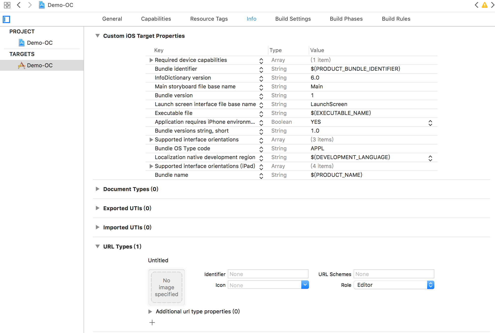
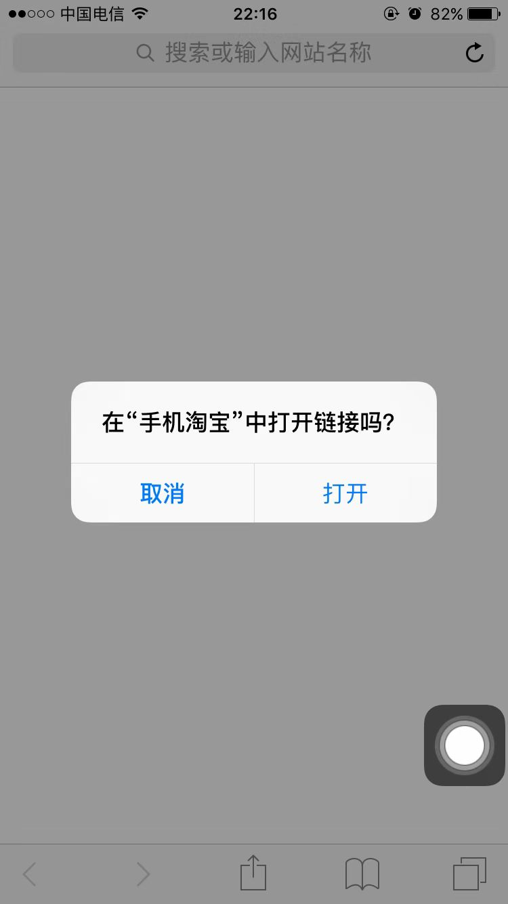
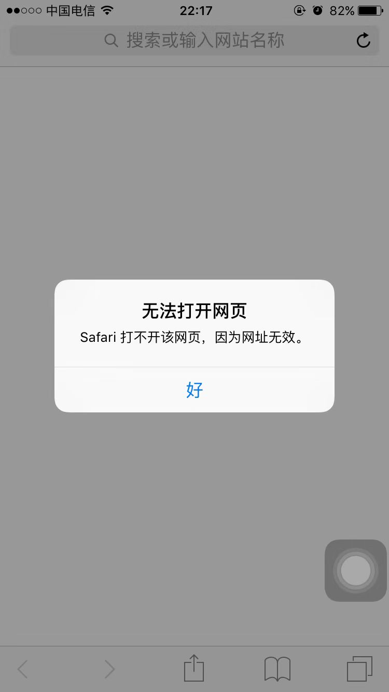
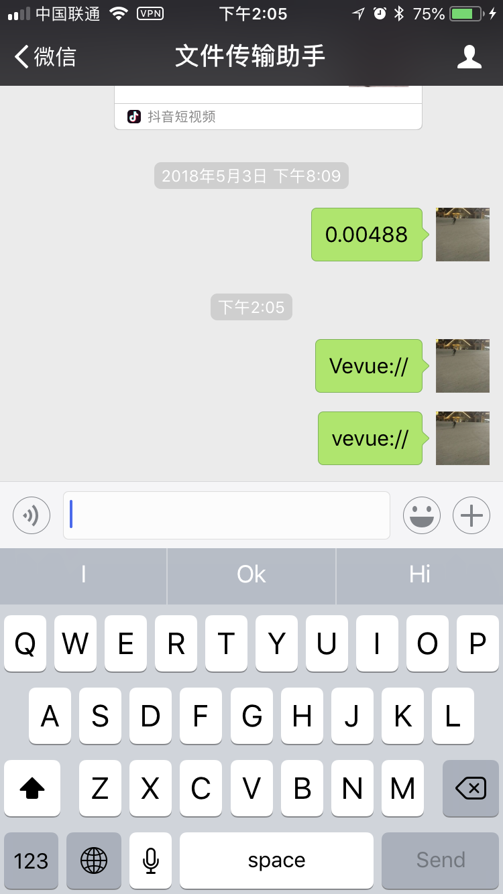
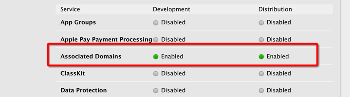
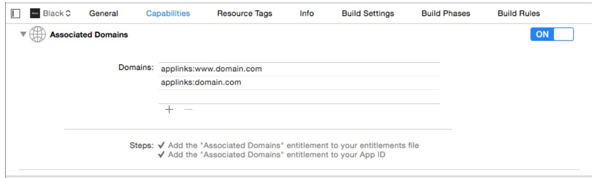

## iOS H5页面打开APP技术总结

iOS端H5页面打开APP的方式目前主要有两种：URL Scheme和Universal Links。其中Universal Links是iOS9.0以后推出的一种新的方案，由于它需要在iOS9.0以后才使用，而且还要兼容微信和iOS的版本，所以在项目中会采用两种方式结合的方式。

**一、URL Scheme**

scheme是iOS9之前比较主流的一种跳转方案了， 更多的是用在了两个APP相互跳转中。也可以在Safari中输入`schema://`跳转到App内部，在项目中如下位置可以配置

 

配置好后安装APP后，直接在访问设置好的 URL Scheme可以直接打开APP，如平时我们用的比较多的淘宝APP，默认的 URL Scheme如下：taobao:// 在浏览器中输入该scheme就会弹出如下

 

 其实这种方式很不顺滑，在每次跳转的时候都会弹框询问。如果iPhone中如果没有安装则会直接弹出错误提示

 

正常产品的思路是如果手机中没有安装APP的话，应跳转到App Store下载页面。我与前端小伙伴沟通后，因为schema跳转失败是没有错误码返回的。前端使用计时器计时，如果在规定时间内没有跳转到APP，则认为是失败的。这种设计确实有一些体验不好。而且在微信中输入schema链接，也无法跳转到APP。因为schema并没有走http/https链接，微信也无法识别。

 

 
但是在微信端就不行了，微信端设置了白名单，完全屏蔽了URL Scheme 用法，除非加入了白名单，像京东就可以直接打开，否则是不可能的，那我们还有下面的办法来解决这个办法。

**二、Universal Links**

**1、简介**

建议大家先看看苹果官方文档https://developer.apple.com/library/content/documentation/General/Conceptual/AppSearch/UniversalLinks.html
Universal Links（通用链接）是**iOS9.0**出的新技术。如果我们的应用支持通用链接，那么就可以通过https链接来打开APP（手机中已经安装此APP），或者跳转到https链接（手机中没有安装此APP）。

**2、实现步骤**

**2.1 \**配置https（必须是https）网站支持\****

创建“apple-app-site-association”文件，注意不带后缀，放到网站根目录，确保可以使用：https://xxx.xxx.xxx/apple-app-site-association 直接可以访问。

apple-app-site-association文件内容如下：
```json 
{
  "applinks": {
      "apps": [],
      "details": [
          {
              "appID": "ABCD1234.com.aaa.app", 
              "paths": [ "/info/*", "/mobile/*"]
          },
          {
              "appID": "EFGH5678.com.bbb.app", 
              "paths": [ "*" ]
          }
      ]
  }
}
```

相关参数如下：

appID = teamId.yourapp's bundle identifier
paths = APP支持的路径列表，只有这些指定的路径的链接，才能被APP所处理，大小写敏感

**2.2 配置苹果证书，开启“Associated Domains”，如下图：**

Identifiers - App IDs –Edit 然后开启打钩 Associated Domains 后保存，配置地址：https://developer.apple.com/account/ios/identifier/bundle



**2.3 配置你的App的Universal Links（通用链接）**

配置如下：项目 targets->Capabilities->Associated Domains，如图填写你的链接域名



域名的格式必须为：applinks:你的域名（ex:applinks:www.domain.com）,可以配置多个

**2.4 在项目中代码处理**

```
 1 - (BOOL)application:(UIApplication *)application continueUserActivity:(NSUserActivity *)userActivity restorationHandler:(void (^)(NSArray<id<UIUserActivityRestoring>> * _Nullable))restorationHandler {
 2     if ([userActivity.activityType isEqualToString:NSUserActivityTypeBrowsingWeb]) {
 3         NSURL *webpageURL = userActivity.webpageURL;
 4         NSString *host = webpageURL.host;
 5         // 在这里写需要的逻辑，比如跳转到某个详情页
 6         if ([host isEqualToString:@"www.aa.tk"]) {
 7             
 8         } else{
 9             [[UIApplication sharedApplication] openURL:webpageURL options:@{} completionHandler:^(BOOL success) {
10                 
11             }];
12         }
13     }
14     return YES;
15 }
```

按照以上步骤配置完成以后就可以测试了。

**三、Universal Links坑以及注意点**

**3.1 配置apple-app-association**

- 域名必须支持https
- 域名根目录下放这个文件apple-app-site-association，不带任何后缀
- 文件为json格式保存为文本即可
- json按着官网的要求填写即可

***测试是否正确，直接访问域名+配置文件名如果能正确访问则放置的位置是正确的。例如你想通过访问”https://aa.test.com/xxx“来打开app，那么你要把配置文件放在”https://aa.test.com/“对应服务器根目录，通过访问”https://aa.test.com/apple-app-association“能直接访问配置文件则是正确的。***

苹果也提供了一个官方网页供我们开发者来验证`https://域名/apple-app-site-association是否有效`

`验证地址如下：`[https://search.developer.apple.com/appsearch-validation-tool/](https://links.jianshu.com/go?to=https%3A%2F%2Fsearch.developer.apple.com%2Fappsearch-validation-tool%2F)

**3.2 跨域问题**

**[重要]**展示地址和打开的地址不能在一个域名下（作者测试发现放在同一服务器下都不行），比如展示页的地址是https://a.domain.com/?id=10，打开的如果是https://a.domain.com/app/?id=10，系统默认是打开页面，而不是触发通用链接打开app

**必须写点击事件跳转到与applinks中添加的域名相同的页面例如[oap.aaaaa.com/info/download.html](http://oap.aaaaa.com/info/download.html)（要跨域),在微信中就直接跳转到了我们的app中了！**

**3.3 通用链接可被屏蔽，点击右上角配置的链接之后，通用链接就失效了**

****

**原因分析**

*因为你点击右上角的网址之后，默认就把通用链接禁用了，需要在Safari中恢复一下，这是iOS本身的机制。*

**解决方案**

1.在微信里面点击右上角“...”，在Safari中打开；

2.往下拉，看到最上面的右上角有一个“打开”的按钮，点击“打开”之后，以后就好了

**解决方案详见：[《iOS通用链接（Universal Links）突然点击无效的解决方案》](http://www.cnblogs.com/vipstone/p/7505571.html)**
